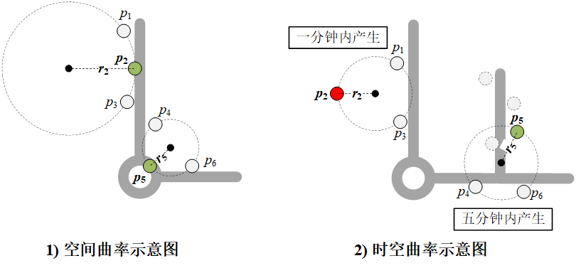
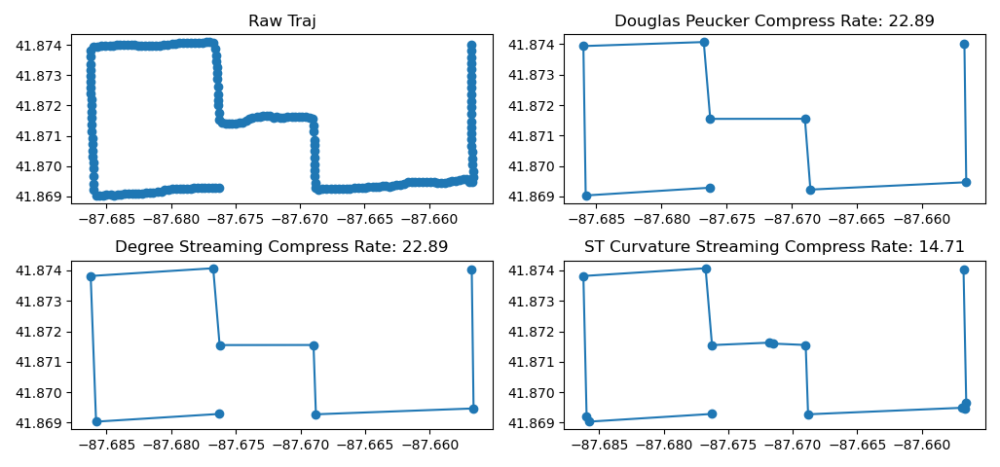

# 轨迹压缩
> 本仓库实现几种轨迹压缩算法

+ 仅考虑空间信息
  + 道格拉斯-普克轨迹压缩算法（Douglas Peucker）
  + 基于空间曲率的流式轨迹压缩算法（Curvature Streaming）
+ 考虑时空信息
  + 基于时空曲率的流式轨迹压缩算法（Spatio-Temporal Curvature Streaming）

直接运行对应的代码文件即可，结果如下图所示：

